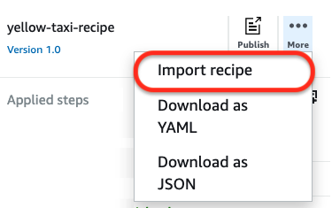
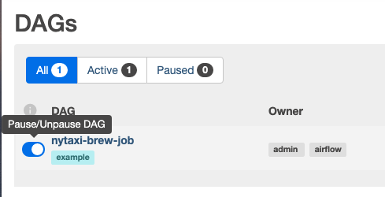
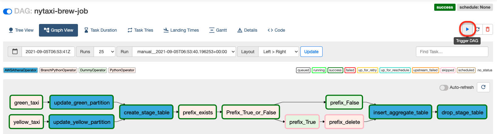

# Orchestrate AWS Glue DataBrew jobs using Amazon Managed Workflows for Apache Airflow

This is codes for amazon blog post: [Orchestrate AWS Glue DataBrew jobs using Amazon Managed Workflows for Apache Airflow](https://aws.amazon.com/blogs/big-data/orchestrate-aws-glue-databrew-jobs-using-amazon-managed-workflows-for-apache-airflow/)


### (Step 1) Data preparation
 Download these datasets and upload the public datasets to the input S3 bucket.
 * [NYC Yellow taxi trip records \(2020-Jan\)](https://s3.amazonaws.com/nyc-tlc/trip+data/yellow_tripdata_2020-01.csv)
 * [NYC Green taxi trip records \(2020-Jan\)](https://s3.amazonaws.com/nyc-tlc/trip+data/green_tripdata_2020-01.csv)
 * [NYC Taxi zone lookup dataset](https://s3.amazonaws.com/nyc-tlc/misc/taxi+_zone_lookup.csv)

<table border="1">
    <thead>
        <tr align="center">
            <th>S3 Input Bucket Structure</th>
            <th>S3 Output Bucket Structure</th>
            <th>Airflow Bucket Structure</th>
        </tr>
    </thead>
    <tbody>
        <tr align="left">
            <td>
                <pre><code>
input-bucket-name
    |- yellow
    |- green
    |- taxi-lookup
                </code></pre>
            </td>
            <td align="left">
                <pre><code>
output-bucket-name
    |- yellow
    |- green
    |- taxi-lookup
                </code></pre>
            </td>
            <td>
                <pre><code>
airflow-bucket-name
    |- dags
    |- requirements
                </code></pre>
            </td>
        </tr>
    </tbody>
</table>

### (Step 2) Create DataBrew projects & Import DataBrew recipes
 After creating databrew projects, import DataBrew recipes. For example:<br/>
 

### (Step 3) Create Athena tables
 Create the following external tables using `./athena/nytaxi-trip-data-aggregated-summary.sql`

### (Step 4) Create Apache Airflow environment
 * Create your airflow environment according to [Amazon Managed workflows for Apache Airflow (MWAA) CDK Python project](https://github.com/ksmin23/my-aws-cdk-examples/tree/main/mwaa)
 * Go to the [IAM Console - Roles](https://console.aws.amazon.com/iam/home?#/roles)
 * Search for the Airflow Instance role, which looks similar to AmazonMWAA-<i>your-airflow-environment-name</i>-xxxx
 * Let’s attach the following permissions to the Airflow Instance role
   + AmazonAthenaFullAccess
   + AwsGlueDataBrewFullAccessPolicy
   + AWSGlueDataBrewServiceRole
   + **inline policy** such as:
        ```
        {
            "Version": "2012-10-17",
            "Statement": [
                {
                    "Effect": "Allow",
                    "Action": [
                        "s3:GetBucketLocation",
                        "s3:GetObject",
                        "s3:ListBucket",
                        "s3:ListBucketMultipartUploads",
                        "s3:ListMultipartUploadParts",
                        "s3:AbortMultipartUpload",
                        "s3:CreateBucket",
                        "s3:PutObject",
                        "s3:PutBucketPublicAccessBlock"
                    ],
                    "Resource": [
                        "arn:aws:s3:::<your-output-bucket-name>",
                        "arn:aws:s3:::<your-output-bucket-name>/*"
                    ]
                }
            ]
        }
        ```

### (Step 5) Create an Airflow DAG
 Upload `requirements.txt` and `ny_taxi_brew_trigger.py` in `./mwaa` directory in to s3.

### (Step 5) Run DAG
 The DAG will be initially set to disabled state by default.
 Enable the DAG using the **On/Off** toggle button to be picked up by the scheduler.<br/> 
 

 To trigger the DAG, click on the **play** button shown below.<br/>
 

## References

 * [Orchestrate AWS Glue DataBrew jobs using Amazon Managed Workflows for Apache Airflow](https://aws.amazon.com/blogs/big-data/orchestrate-aws-glue-databrew-jobs-using-amazon-managed-workflows-for-apache-airflow/)
 * [Amazon MWAA for Analytics Workshop](https://amazon-mwaa-for-analytics.workshop.aws/en/)
 * [Get started with Amazon Managed Workflows for Apache Airflow \(MWAA\)](https://docs.aws.amazon.com/mwaa/latest/userguide/get-started.html)
 * [Amazon Managed workflows for Apache Airflow (MWAA) CDK Python project](https://github.com/ksmin23/my-aws-cdk-examples/tree/main/mwaa)